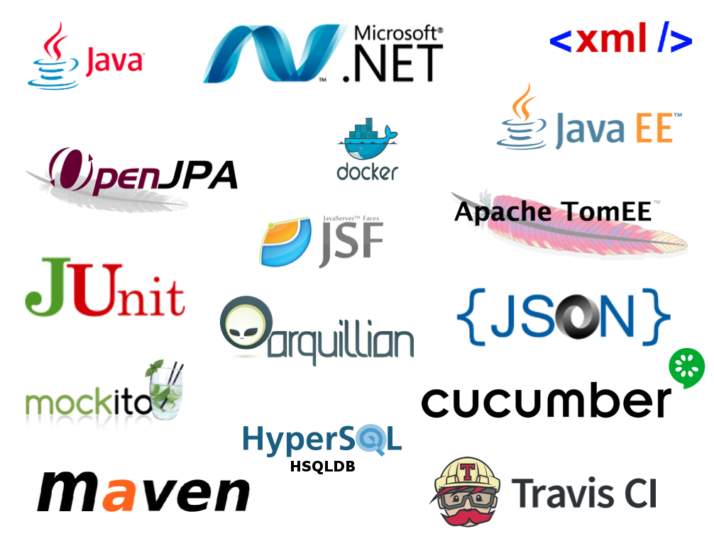

# projet-isa-devops-20-team-d-20

  * Auteurs: **Team D**
    * DJEKINOU Paul-Marie
    * KOFFI Paul
    * MESSAN Aurore
    * MONIN Donélia
    * NABAGOU Djotiham
  * Version: en dévelopment
  * Statuts d'Intégration continue : [![Build Status]
  
 # Vue d'ensemble
 Cette étude de cas est utilisée pour illustrer les différentes technologies impliquées dans le cours d'Introduction à l'Architecture Logicielle couplé au DEVOPS, donné à Polytech Nice - Sophia Antipolis au niveau universitaire. Ce code de démonstration nécessite les logiciels suivants pour fonctionner correctement :
 
   * Environnement de Build & de configuration J2E : Maven 3
   * Environnement de déploiement : Docker 2.2.0.5 (Stable)
   * Langage d'implémentation J2E : Java 8
   * Langage d'implémentation .Net : Mono > 3.12
   
  ## Vision du produit
  Drone Delivery est un système de livraison de colis par des drones, mis en place par Livrair, une nouvelle startup lancée par de brillants diplômés de Polytech.
  Le but est de fournir un service de livraison continue aux heures convenues grâce aux nombreux avantages qu'offrent les drones à savoir éviter les embouteillages, les restrictions de circulation, etc.
  Les clients peuvent alors passer leurs commandes à leurs fournisseurs habituels dont les transporteurs de colis en relation avec Livrair, effectueront des réservations chez Livrair pour livrer les clients par drone.
    
  L'architecture logicielle à développer dans ce document s'appuiera sur la pile suivante :
  
  Le rapport d'Architecture est disponible [ici](https://github.com/pns-isa-devops/projet-isa-devops-20-team-d-20/blob/master/docs/architecture.pdf).
  
  ## Comment utiliser ce repository
  * La branche `master` (la branche par défaut) représente la dernière version stable du système.
  * La branche `develop` représente le système en cours de développement.
    * Issues can be submitted using the [GitHub ticketing system](https://github.com/pns-isa-devops/projet-isa-devops-20-team-d-20/issues)
  
  ### Récupération du projet
  Ce projet contient des sous-modules github et nécessite de ce fait de suivre les insctructions suivantes pour effectuer une récupération complète du projet.
  1. Effectuer un clone classique du projet en faisant ```git clone url_du_repo``` ou en récupérant le zip depuis cette page.
  2. Lancer le script [gitUpdateAll.sh](./gitUpdateAll.sh) se trouvant dans à la racine.
    
  ### Compilation
  Pour compiler la démonstration (parties j2e, .Net et client), exécutez simplement le script de compilation [build.sh](./build.sh). La première compilation peut prendre beaucoup de temps, étant donné que Maven devra télécharger toutes les dépendances java nécessaires pour construire et exécuter le système.
  
    team-d@machine $ ./build.sh
    
  À l'issue de cette exécution, le projet aura été entièrement compilé et les images Docker des 3 parties j2e, .Net et client auront été construites.
  ### Execution
  Pour exécuter la démonstration, deux modes d'exécution s'offrent à vous :
  * Exécution avec maven :
  
  Démarrez d'abord les deux serveurs dans deux terminaux différents, puis démarrez le client distant dans un troisième :
  
    # Drone delivery terminal (J2E)						(^C to stop)
    team-d@machine $ cd drone-delivery/Web
    team-d@machine drone-delivery/Web$ mvn package tomee::run
  
    # .Net terminal						(return to stop)
    team-d@machine $ cd partners/DotNet
    team-d@machine partners/DotNet$ mono server.exe
    
    # Remote Client (Clissandre CLI)						(bye to stop)
    team-d@machine $ cd client/CliClissandre
    team-d@machine client/CliClissandre$ mvn exec::java

  * Exécution dans les conteneurs docker
  
  Il suffit dans ce cas-ci de lancer la commande ```docker-compose up -d``` dans le répertoire docker puis de lancer les différentes commandes ```docker attach``` pour accéder au terminal souhaité :
   
    # Lancement des conteneurs docker                   
    team-d@machine $ cd docker
    team-d@machine docker$ docker-compose up -d
  
    # Accéder au terminal J2E                               
    team-d@machine $ docker attach dd_system
    
    # Accéder au terminal DotNet                               
    team-d@machine $ docker attach dd_partners
    
    # Accéder au terminal client                               
    team-d@machine $ docker attach dd_client-clissandre
    
    # (Eteindre les serveurs à la fin d'exécution des scénarios)
    team-d@machine $ cd docker
    team-d@machine docker$ docker-compose down

  
  ## Technological Stack
  
  <p align="center">
    
  </p>
